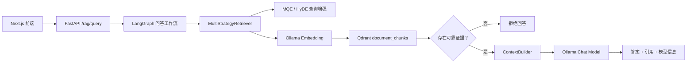
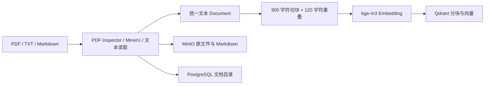

# AI 智能体代码与运行逻辑说明

## 1. 文档目的

本文说明 Local RAG 项目中 AI 端与“智能体”相关的代码，包括：

- 当前实现属于哪一种智能体；
- 已经完成了哪些 AI 能力；
- 一次问答如何在各模块之间流转；
- 检索增强、证据门控、模型降级和引用是如何工作的；
- 当前实现的边界，以及后续应优先补充的能力。

本文对应的主要代码位于 `services/python-rag/app/`。

---

## 2. 当前智能体的定位

当前系统实现的是一个**证据优先的 RAG 工作流智能体**，核心编排框架为 LangGraph。

它不是能够自由制定计划、任意选择工具并反复执行的通用自主智能体，而是一个路径受控的问答工作流：

1. 接收用户问题；
2. 从知识库检索证据；
3. 判断是否存在可用证据；
4. 有证据才调用大模型生成答案；
5. 没有证据则直接拒答；
6. 将实际使用的证据作为引用返回。

这种设计牺牲了一部分自主性，但更适合企业知识库，因为执行路径清晰、容易测试，并且能降低模型脱离资料编造答案的风险。

---

## 3. AI 端整体架构



主要模块及职责如下：

| 模块 | 文件 | 职责 |
|---|---|---|
| API 入口 | `app/main.py` | 接收上传、索引和问答请求，返回统一响应 |
| 智能体编排 | `app/graph.py` | 定义状态、节点、条件路由、生成和拒答逻辑 |
| 检索策略 | `app/retrieval.py` | 实现向量、MQE、HyDE 和 hybrid 检索 |
| 上下文构建 | `app/context.py` | 证据去重、编号及长度预算控制 |
| 向量数据库 | `app/vector_store.py` | 文档向量写入、过滤和相似度查询 |
| 模型适配 | `app/ollama.py` | 模型发现、聊天生成和 Embedding 调用 |
| 嵌入抽象 | `app/embeddings.py` | 提供可替换的统一 Embedding 接口 |
| 文档处理 | `app/document_processor.py` | 文本归一化、重叠切块和索引请求构造 |
| 数据模型 | `app/models.py` | 定义问题、答案、引用、文档和分块结构 |
| 统一门面 | `app/pipeline.py` | 封装文档入库与检索操作，便于测试和替换实现 |

---

## 4. 已经处理和实现的智能体能力

### 4.1 LangGraph 状态机

`graph.py` 使用 `RAGState` 保存一次问答运行中的状态，主要字段包括：

- `question`：用户问题；
- `document_ids`：限定检索的文档范围；
- `strategy`：检索策略；
- `citations`：检索得到的证据；
- `answer`：最终答案；
- `status`：`answered`、`refused` 或 `unavailable`；
- `reason`：拒答或降级原因；
- `model`：实际使用的聊天模型。

当前图包含三个执行节点：

1. `retrieve`：召回知识库证据；
2. `generate_answer`：根据证据生成答案；
3. `refuse_answer`：证据不足时拒答。

节点名称使用 `generate_answer` 而不是 `answer`，是为了避免与 `RAGState.answer` 状态字段发生命名冲突。

### 4.2 条件路由与拒答

`evidence_gate()` 是当前最重要的安全边界：

```text
citations 非空 -> generate_answer
citations 为空 -> refuse_answer
```

如果 Qdrant 查询异常，`retrieve()` 会返回空引用，工作流随后进入拒答分支，而不是让模型在没有资料的情况下继续生成。

当前拒答响应为：

```text
现有知识库中没有足以支持该问题的可靠证据，因此我不能确认答案。
```

同时返回 `reason=insufficient_evidence`，便于前端展示和后续统计。

### 4.3 四种检索策略

`MultiStrategyRetriever` 支持以下策略：

| 策略 | 行为 | 模型调用成本 |
|---|---|---:|
| `vector` | 直接对原问题进行向量检索 | 仅 Embedding |
| `mqe` | 生成最多 3 个不同表达的查询，再分别检索 | 增加 1 次聊天模型调用 |
| `hyde` | 生成一段假设性答案，将其作为检索文本 | 增加 1 次聊天模型调用 |
| `hybrid` | 同时使用原问题、MQE 查询和 HyDE 文本 | 增加 2 次聊天模型调用 |

这里的 `hybrid` 指多种**稠密向量查询方式的融合**，还不是“向量 + BM25/关键词”的完整混合检索。

MQE 和 HyDE 只是帮助召回证据，它们生成的内容不会被直接当作真实答案。

### 4.4 RRF 多路召回融合

当一次问题产生多条检索查询时，每条查询会得到一组排序结果。系统使用 Reciprocal Rank Fusion 思路累加分数：

```text
score += 1 / (60 + rank + 1)
```

同一个文档分块如果在多路结果中反复出现，其融合分数会更高。系统随后去重、排序，并截取 `RETRIEVAL_TOP_K` 条结果。

### 4.5 向量检索和质量过滤

`VectorStore` 当前使用 Qdrant 集合 `document_chunks`。

入库时保存：

- 文档 ID、名称和版本；
- chunk 顺序；
- 页码和章节；
- 原始文本；
- 字符起止位置；
- 解析置信度。

查询时：

1. 使用 Ollama 的 `bge-m3` 生成问题向量；
2. 可按 `document_ids` 限制文档范围；
3. 应用向量相似度阈值；
4. 过滤置信度低于 `0.7` 的分块；
5. 将 Qdrant 相似度转换为引用置信度返回。

### 4.6 上下文预算与证据编号

`ContextBuilder` 不会把所有召回内容无条件发送给模型。它会：

- 统一空白字符后去除重复证据；
- 将证据编号为 `[1]`、`[2]` 等；
- 遵守 `CONTEXT_MAX_CHARS` 字符预算；
- 当最后一条证据超出预算时进行截断；
- 只把真正放进上下文的引用返回给前端。

这保证了答案中的引用编号和本次实际提供给模型的证据集保持一致。

### 4.7 受约束的答案生成

生成节点向模型发送的系统要求是：

```text
你是严格的本地知识库助手。只能根据给定证据回答；
不能补充外部知识；每项结论都要标记 [编号]。
```

聊天参数将 `temperature` 设置为 `0`，以减少同一个问题多次生成时的随机变化。

注意：当前系统通过 Prompt 要求模型标记引用，但尚未在服务端逐句校验模型输出的 `[编号]` 是否真实支持对应结论。

### 4.8 模型发现与自动降级

`OllamaClient.choose_chat_model()` 会先读取本地 Ollama 已安装模型：

1. 优先选择 `CHAT_MODEL`，默认 `qwen3:14b`；
2. 主模型不存在时使用 `FALLBACK_CHAT_MODEL`，默认 `qwen3:8b`；
3. 两者都不存在时返回服务不可用，不继续生成答案。

Embedding 模型默认是 `bge-m3`。聊天模型和 Embedding 模型通过同一个 Ollama 服务调用，但承担不同职责。

### 4.9 可替换与可测试设计

代码对以下依赖提供了注入点：

- `RAGPipeline` 可注入文档处理器、向量存储和检索器；
- `MultiStrategyRetriever` 可注入向量存储和语言模型客户端；
- `VectorStore` 可注入 Embedding 实现；
- `OllamaEmbedding` 实现统一的 `BaseEmbedding` 接口。

因此后续可以在不重写智能体主流程的情况下替换 Embedding、向量数据库或查询增强模型。

现有测试已经覆盖：

- 没有证据时必须进入拒答分支；
- LangGraph 可以成功编译且不存在状态字段冲突；
- 上下文去重和字符预算；
- 文档重叠切块、字符偏移和空文档校验。

---

## 5. 一次问答的完整运行逻辑

以 `POST /rag/query` 为例：

### 步骤 1：请求校验

FastAPI 将请求解析为 `QueryRequest`：

```json
{
  "question": "需求评审需要哪些角色参加？",
  "document_ids": ["doc-1"],
  "strategy": "hybrid"
}
```

问题不能为空且最长为 4000 个字符，检索策略只能是四种已定义值之一。

### 步骤 2：初始化图状态

`run_query()` 将问题、文档范围和策略写入 `RAGState`，然后调用 LangGraph 的 `ainvoke()`。

### 步骤 3：生成检索查询

如果策略是 `hybrid`，查询集合通常包含：

- 用户原问题；
- 最多 3 条 MQE 改写；
- 1 条 HyDE 假设性知识库正文。

如果聊天模型不可用或查询增强失败，异常会被忽略，系统退回原问题向量检索。

### 步骤 4：检索和融合

每条查询分别生成向量并查询 Qdrant。低相似度、低解析置信度或不属于指定文档的数据不会进入候选集合。多路候选使用 RRF 去重和排序。

### 步骤 5：证据门控

- 候选为空：进入 `refuse_answer`；
- 候选非空：进入 `generate_answer`。

### 步骤 6：构建模型上下文

候选证据被去重、编号并限制在最大字符预算内。只有保留下来的证据会同时出现在模型上下文和最终 `citations` 中。

### 步骤 7：选择模型并生成答案

系统检查本地模型，优先使用主模型，必要时降级到备用模型。模型只能看到用户问题和本次检索证据，不会自动获得外部互联网知识。

### 步骤 8：返回结构化结果

成功时返回：

```json
{
  "status": "answered",
  "answer": "……[1]",
  "citations": [],
  "model": "qwen3:14b",
  "reason": null
}
```

无证据时返回 `refused`；模型不可用时返回 `unavailable`。

---

## 6. 文档如何进入智能体知识库

问答智能体依赖预先完成的文档入库流程：



目前文本型 PDF 由 PDF Inspector 直接提取，扫描型或混合型 PDF 交给 MinerU。解析结果随后经过固定字符长度切块并写入 Qdrant。

智能体问答阶段主要读取 Qdrant；PostgreSQL 用于文档目录，MinIO 用于原文件和解析结果保存。

---

## 7. 当前还不具备的智能体能力

以下能力尚未完成，不能视为当前系统已经支持：

### 7.1 没有自主工具循环

当前智能体不会根据中间结果自行决定调用数据库、网页搜索、计算器或业务 API，也没有“计划—执行—观察—再计划”的循环。

### 7.2 没有真正的会话记忆

`QueryRequest` 虽然包含 `conversation_id`，但当前 `run_query()` 没有使用该字段，也没有保存历史消息、主题摘要或用户偏好。

### 7.3 reranker 尚未接入

配置中存在 `RERANK_MODEL=qllama/bge-reranker-v2-m3`，但当前排序实际使用的是 Qdrant 相似度和 RRF，没有调用该 reranker 重新打分。

### 7.4 不是真正的关键词混合检索

当前 `hybrid` 是 MQE、HyDE 和原问题的多路向量融合，尚未加入 BM25、稀疏向量或精确关键词召回。因此日期、合同编号、型号和专有名词查询仍可能漏召回。

### 7.5 证据门控仍较简单

当前判断逻辑只检查 `citations` 是否为空，没有综合判断：

- 最高与平均相关分；
- 来源数量；
- OCR 风险；
- 页码和定位是否完整；
- 多来源是否互相冲突；
- 文档版本和用户权限。

### 7.6 引用没有逐条声明校验

模型被要求输出 `[编号]`，但服务端还没有把答案拆成事实声明，并校验每条声明是否由所引用的原文支持。

### 7.7 文档分块仍是固定字符切分

当前默认每 900 个字符切一块并重叠 120 个字符，没有真正理解标题、自然段、表格、合同条款或父子 chunk。解析质量和切分质量会直接影响智能体检索效果。

---

## 8. 推荐的下一阶段演进顺序

### 第一优先级：提高证据质量

1. 保存解析器输出的页码、标题路径、表格、坐标和 OCR 置信度；
2. 将固定字符切块替换为标题/段落/表格感知切块；
3. 对扫描件采用 PaddleOCR PP-StructureV3，并保留逐页质量信息；
4. 建立一组真实问题和标准证据，用 Recall@K 评估检索。

### 第二优先级：完善检索链路

1. 增加 BM25 或 Qdrant sparse vector；
2. 使用 RRF 融合稠密与稀疏检索；
3. 接入已经配置的 reranker；
4. 最终只向模型传递重排后的 4～6 个高质量证据块。

### 第三优先级：加强智能体决策

增加查询路由节点，将请求区分为：

- 文档状态和列表查询：直接访问数据库，不调用大模型；
- 精确编号、日期、文件名查询：优先关键词检索；
- 事实问答：走标准 RAG；
- 总结、对比和跨文档问题：扩大召回并使用专门 Prompt；
- 证据冲突：返回冲突状态和双方来源，不强行生成单一结论。

### 第四优先级：增加记忆和工具

在知识库事实与会话记忆之间建立明确边界后，再增加：

- 服务端对话摘要；
- 用户当前任务状态；
- 受权限控制的数据库查询工具；
- 可审计的工具调用记录；
- 最大步骤数、超时和失败回退机制。

---

## 9. 总结

当前 AI 端已经形成了一个可运行的最小智能体闭环：

```text
问题 -> 查询增强 -> 向量检索 -> RRF 融合 -> 证据门控
     -> 上下文去重与预算 -> 本地模型生成 / 拒答 -> 引用返回
```

其主要特点是本地运行、流程可控、无证据拒答和结果可引用。它已经具备 RAG 工作流智能体的基础，但离企业级智能体仍缺少结构化解析、权限与版本过滤、真正的混合检索、reranker、声明级引用校验、会话记忆和可审计工具调用。

后续优化不应首先增加更多自主步骤，而应先提高“解析结果、检索证据和引用定位”的可靠性。证据链稳定后，再扩展路由、记忆和工具能力，整体风险更低。
