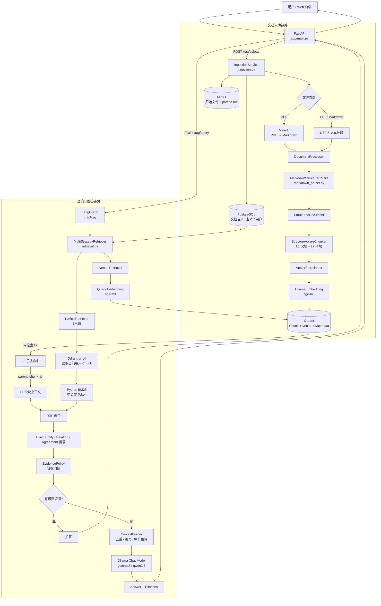
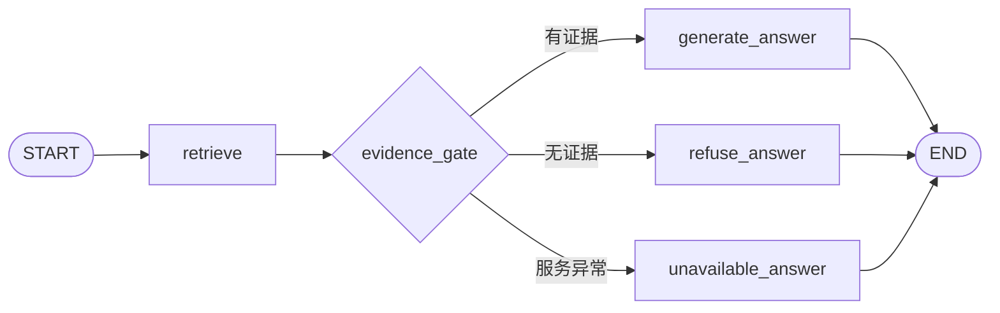

# Python RAG 系统架构与代码理解指南

> 基于 `main` 分支当前实现整理。目标是帮助快速理解 `services/python-rag` 的运行链路、模块职责、数据流和关键设计。

## 1. 系统架构图



---

## 2. 一句话理解整个系统

当前 Python RAG 的核心流程可以概括为：

> 文档先被解析成结构化内容，再按章节生成 L1 父块和 L2 子块；查询时使用 L2 做稠密向量检索，同时使用 BM25 做词法检索，经 RRF 融合后回填 L1 上下文，并经过证据门控，只有证据足够可靠才调用本地 LLM 生成答案，否则直接拒答。

它并不是最基础的：

```text
embedding → vector DB → LLM
```

而是：

```text
结构化解析
  ↓
分层 Chunk
  ↓
Dense + BM25
  ↓
RRF 融合
  ↓
Evidence Gate
  ↓
Context Builder
  ↓
LLM
```

---

## 3. 核心模块职责

| 文件 | 主要职责 |
|---|---|
| `main.py` | FastAPI 接口、上传、查询、文档和会话 API |
| `ingestion.py` | 文档解析和入库编排 |
| `document_processor.py` | 普通文本转标准 Document / StructuredDocument |
| `markdown_parser.py` | Markdown/TXT 结构解析 |
| `structure_chunker.py` | 生成 L1 / L2 分层 Chunk |
| `vector_store.py` | Qdrant 建库、写入、向量检索、Chunk 扫描 |
| `query_analysis.py` | 中英文 query token、exact term、关系意图分析 |
| `lexical_retriever.py` | Python 内存 BM25 检索 |
| `retrieval.py` | Dense、MQE、HyDE、Hybrid 与 RRF 融合 |
| `evidence.py` | 对召回结果做证据可靠性门控 |
| `context.py` | 对最终证据去重、编号、限制 prompt 预算 |
| `graph.py` | LangGraph：检索 → 回答 / 拒答 / 服务不可用 |
| `ollama.py` | 本地 Chat / Embedding 模型调用 |
| `models.py` | Pydantic 数据模型 |
| `settings.py` | 环境变量和服务配置 |

---

## 4. 文档入库链路

入口：

```http
POST /rag/upload
```

调用顺序：

```text
main.upload()
  ↓
IngestionService.parse()
  ↓
┌──────────── PDF ────────────┐
│ MinerU → Markdown            │
└──────────────────────────────┘
              或
┌──── TXT / Markdown ─────────┐
│ UTF-8 decode                 │
└──────────────────────────────┘
  ↓
DocumentProcessor
  ↓
MarkdownStructureParser
  ↓
StructuredDocument
  ↓
StructureAwareChunker
  ↓
L1 + L2 Chunk
  ↓
IndexRequest
  ↓
VectorStore.index()
  ↓
OllamaEmbedding / bge-m3
  ↓
Qdrant
```

同时系统还会把数据分散保存到三个存储：

| 存储 | 保存内容 |
|---|---|
| PostgreSQL | 文档目录、文档版本、用户、会话等状态 |
| MinIO | 原始文件和解析后的 Markdown |
| Qdrant | Chunk、向量、结构元数据和检索字段 |

---

## 5. 文档结构化

### 5.1 DocumentProcessor

`DocumentProcessor` 本身很薄，主要作用是统一数据结构：

```text
字符串
  ↓
Document
  ↓
MarkdownStructureParser
  ↓
StructuredDocument
```

真正决定语义结构的是 `markdown_parser.py`。

### 5.2 MarkdownStructureParser

它不是简单按字符数切文档，而是先识别：

- heading
- paragraph
- list_item
- table_row
- code
- section_path
- char_start / char_end

例如：

```markdown
# RAG

RAG 是一种检索增强生成技术。

## 检索

- Vector Search
- BM25
```

会先被转换成结构块：

```text
heading: RAG
paragraph: RAG 是一种检索增强生成技术
heading: 检索
list_item: Vector Search
list_item: BM25
```

这样后面的 Chunk 可以保留章节语义，而不是把不同章节机械拼接在一起。

---

## 6. L1 / L2 分层 Chunk

`StructureAwareChunker` 是当前实现里非常关键的一层。

它生成两级 Chunk：

```text
L1 Parent Chunk
└── L2 Child Chunk
└── L2 Child Chunk
└── L2 Child Chunk
```

### L1

L1 基本对应一个完整章节，用于给 LLM 提供上下文。

### L2

L2 是更短的子块，用于提高向量搜索精度。

所以设计原则是：

> 小块负责找，大块负责答。

检索流程：

```text
Question
  ↓
Embedding
  ↓
检索 L2
  ↓
命中 parent_chunk_id
  ↓
找到对应 L1
  ↓
把 L1 放入 Citation
  ↓
交给 LLM
```

这样既避免大 Chunk 向量表达过于模糊，也避免小 Chunk 给模型时上下文不完整。

---

## 7. 查询主链路

查询入口：

```http
POST /rag/query
```

随后：

```text
main.query()
  ↓
run_query()
  ↓
LangGraph
  ↓
retrieve()
  ↓
MultiStrategyRetriever.retrieve()
```

LangGraph 当前结构并不复杂：



它的作用主要是把三种状态明确分开：

1. 有可靠证据 → 回答
2. 没有可靠证据 → 拒答
3. Qdrant / Catalog 等不可用 → unavailable

---

## 8. Dense Retrieval

向量检索由 `VectorStore.search()` 完成。

首先将用户问题转成向量：

```text
question
  ↓
Ollama /api/embed
  ↓
bge-m3
  ↓
query vector
```

然后进入 Qdrant。

### 关键实现：只检索 L2

向量查询强制：

```text
owner_id = 当前用户
level = 2
```

即只搜索 L2 子块。

命中后通过：

```text
parent_chunk_id
```

找对应的 L1。

最终生成的 Citation：

- `excerpt` 使用 L1 完整内容
- `dense_score` 使用命中的 L2 相似度

因此可以理解成：

```text
检索依据 = L2
LLM 上下文 = L1
```

这是当前 RAG 的核心设计之一。

---

## 9. Lexical Retrieval / BM25

混合检索模式下还会执行 `LexicalRetriever`。

当前并没有 Elasticsearch / OpenSearch，而是：

```text
Qdrant scroll
  ↓
拉取当前用户、当前版本范围内的 Chunk
  ↓
Python 内存中计算 BM25
```

这是 Demo 规模实现。

当前代码限制最多读取约 10000 个 Chunk，因此适合本地或中小规模演示，不适合大规模生产。

---

## 10. 中文和英文 Query Analysis

`query_analysis.py` 没有依赖 jieba。

中文使用：

- 2-gram
- 3-gram
- 4-gram
- 短完整短语

英文和技术标识符直接保留，例如：

- Qdrant
- RAG
- embedding
- FastAPI

除此之外，Query Analysis 还提取通用关系意图：

- definition
- reason
- method
- comparison
- summary
- time
- location
- person
- quantity

例如：

```text
“为什么需要向量数据库？”
```

会检测：

```text
relation = reason
```

而：

```text
“RAG 是什么？”
```

会检测：

```text
relation = definition
```

这些信号会参与 BM25 结果质量判断。

---

## 11. Exact Entity 和 Relation Coverage

BM25 结果除了普通词面分数，还有两个重要信号：

### exact_entity_match

如果 query 中出现明确技术词、公司名或引用短语，并且 Chunk 也包含它，就视为 exact match。

### relation_coverage

如果问题问“为什么”，Chunk 中有“因为 / 原因 / 由于 / 原理”等支持原因关系的表达，就认为该 Chunk 覆盖了用户所问的关系。

这些信号会影响召回排序，也会参与后续证据门控。

---

## 12. Dense + BM25 如何融合

当前使用 Reciprocal Rank Fusion（RRF）。

概念上：

```text
score += 1 / (60 + rank)
```

Dense 和 BM25 两路分别排序，再按 Chunk ID 合并。

如果同一个 Chunk 同时被两路检索命中，会得到更高的融合分。

当前实现还加入两个轻量 bonus：

- exact entity + relation coverage
- dense 与 lexical 双路同时命中

因此当前所谓 Hybrid Retrieval 是：

```text
Dense
  +
BM25
  +
RRF
  +
结构化信号 bonus
```

---

## 13. 当前还没有真正的 Cross-Encoder Reranker

配置中已经有：

```text
rerank_model = qllama/bge-reranker-v2-m3
```

但当前主链中没有实际调用这个模型。

所以目前不是：

```text
Dense + BM25
  ↓
RRF
  ↓
BGE Reranker
  ↓
Top K
```

而是：

```text
Dense + BM25
  ↓
RRF
  ↓
EvidencePolicy
```

如果以后补真正的 reranker，推荐位置是：

```text
Dense + BM25
  ↓
RRF Top 20
  ↓
Cross-Encoder Reranker
  ↓
Top 6
  ↓
EvidencePolicy
```

---

## 14. Evidence-first RAG

召回结果不会直接送给 LLM。

`EvidencePolicy` 会先检查是否足以支撑回答。

主要考虑：

- parser_confidence
- dense_score
- exact_entity_match
- relation_coverage
- lexical_score

例如解析置信度低于一定阈值时，会直接过滤。

如果没有证据通过：

```text
citations = []
  ↓
evidence_gate
  ↓
refuse_answer
```

系统返回：

> 现有知识库中没有足以支持该问题的可靠证据，因此我不能确认答案。

这属于当前实现里重要的防幻觉机制。

---

## 15. ContextBuilder

通过证据门控之后，`ContextBuilder` 会：

1. 去重
2. 给证据编号
3. 按字符预算截断
4. 返回实际使用的 Citation

最终上下文类似：

```text
[1] RAG 是 Retrieval Augmented Generation...

[2] Dense Retrieval 使用 embedding...

[3] BM25 是一种词法检索...
```

然后交给 Ollama。

---

## 16. Ollama

`ollama.py` 同时承担：

### Embedding

```text
POST /api/embed
model = bge-m3
```

### Chat

优先模型：

```text
gemma3:latest
```

fallback：

```text
qwen2.5:7b
```

生成时温度设置为：

```text
temperature = 0
```

System Prompt 明确要求：

- 只能根据给定证据回答
- 不能补充外部知识
- 结论需要引用证据编号

---

## 17. 一次完整查询示例

用户提问：

```text
RAG 为什么要使用混合检索？
```

完整链路：

```text
Web
 ↓
POST /rag/query
 ↓
FastAPI main.py
 ↓
LangGraph graph.py
 ↓
MultiStrategyRetriever
 ↓
┌─────────────────────────────┐
│ Dense Retrieval             │
│ question → bge-m3 → Qdrant │
└─────────────────────────────┘
            +
┌─────────────────────────────┐
│ Lexical Retrieval           │
│ tokenize → BM25             │
└─────────────────────────────┘
 ↓
RRF Fusion
 ↓
Exact / Relation Signals
 ↓
Top K Candidates
 ↓
EvidencePolicy
 ↓
最多保留可靠证据
 ↓
ContextBuilder
 ↓
Ollama
 ↓
Answer + Citations
```

---

## 18. 推荐阅读代码顺序

### 第一轮：先搞懂查询主链

```text
main.py
  ↓
graph.py
  ↓
retrieval.py
  ↓
vector_store.py
```

目标：理解 API、LangGraph、Hybrid Retrieval 和 Qdrant 的关系。

### 第二轮：理解文档如何进入向量库

```text
ingestion.py
  ↓
document_processor.py
  ↓
markdown_parser.py
  ↓
structure_chunker.py
```

目标：理解从原始文档到 L1/L2 Chunk 的过程。

### 第三轮：理解召回质量控制

```text
query_analysis.py
  ↓
lexical_retriever.py
  ↓
evidence.py
  ↓
context.py
```

目标：理解 BM25、关系信号、证据门控和最终上下文。

最后再看：

```text
models.py
settings.py
ollama.py
```

---

## 19. 当前实现里值得注意的几个点

### 19.1 embedding_text 已生成，但没有真正用于向量化

`StructureAwareChunker` 会生成：

```python
embedding_text = f"章节：{context}\n\n{text}"
```

这是为了把章节上下文一起编码进向量。

但 `VectorStore.index()` 当前实际使用：

```python
[chunk.text for chunk in request.chunks]
```

并没有使用：

```python
chunk.embedding_text
```

更符合原设计的写法应该是：

```python
[
    chunk.embedding_text or chunk.text
    for chunk in request.chunks
]
```

否则构造出来的章节上下文没有进入 embedding。

### 19.2 RAGPipeline.ingest() 的 owner_id 链路不完整

`pipeline.py` 中：

```python
request = self.processor.to_index_request(document)
return await self.store.index(request)
```

而 `VectorStore.index()` 明确要求：

```python
request.owner_id is not None
```

`DocumentProcessor.to_index_request()` 没有设置 owner_id。

因此直接使用 `RAGPipeline.ingest()` 时可能触发：

```text
ValueError: owner_id is required for vector indexing
```

当前正常的 `/rag/upload` 主链会手动补 owner_id，因此主要 API 不依赖这条旧门面路径。

### 19.3 rerank_model 目前只是配置

当前 Hybrid Retrieval 已经做了多路召回融合，但还没有真正调用 Cross-Encoder reranker。

### 19.4 Python BM25 只适合 Demo 规模

当前每次 lexical search 都需要从 Qdrant scroll Chunk 后再在 Python 中计算 BM25。

后续数据规模扩大时，更适合迁移到：

- Qdrant sparse vector
- Elasticsearch
- OpenSearch
- 其他专用倒排索引

---

## 20. 最值得记住的八个文件

```text
main.py
   ↓ API

ingestion.py
   ↓ 入库编排

structure_chunker.py
   ↓ L1 / L2

vector_store.py
   ↓ Qdrant + Dense

lexical_retriever.py
   ↓ BM25

retrieval.py
   ↓ Hybrid + RRF

evidence.py
   ↓ Evidence Gate

graph.py
   ↓ Answer / Refuse / Unavailable
```

如果只掌握这八个文件，就已经能理解 Python RAG 主体的大部分逻辑。

---

## 21. 最终心智模型

### 写入

```text
main.py
  ↓
ingestion.py
  ↓
markdown_parser.py
  ↓
structure_chunker.py
  ↓
vector_store.py
  ↓
Qdrant
```

### 查询

```text
main.py
  ↓
graph.py
  ↓
retrieval.py
    ├── vector_store.py
    │      ↓
    │    Dense
    │
    └── lexical_retriever.py
           ↓
         BM25
          │
          └──────┐
                 ↓
                RRF
                 ↓
            evidence.py
                 ↓
             context.py
                 ↓
             ollama.py
                 ↓
               Answer
```

理解这两条链路之后，再深入某个具体函数会容易很多。
